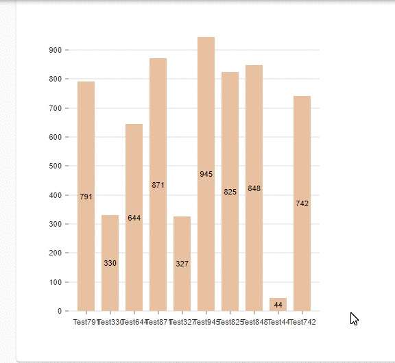
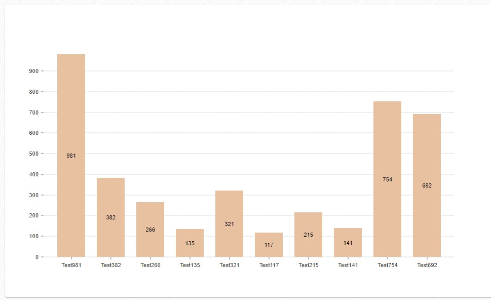
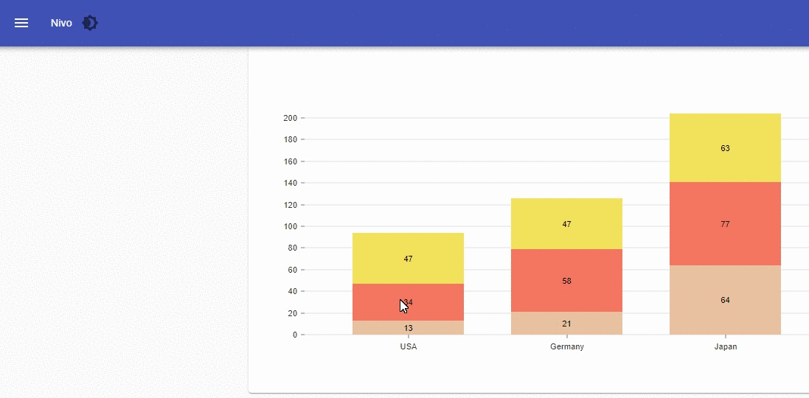

# Charts

Universal Dashboard provides several built-in charting solutions to help visualize your data retrieved from PowerShell.

## ChartJS


This documentation is for the prelease version of PowerShell Universal. You can download pre-release versions on our [Downloads page](https://ironmansoftware.com/downloads).


Universal Dashboard integrates with [ChartJS](https://www.chartjs.org/). 

### Creating a Chart

To create a chart, use `New-UDChartJS` and `New-UDChartJSData`. The below chart shows the top ten CPU using processes.

```text
 $Data = Get-Process | Sort-Object -Property CPU -Descending | Select-Object -First 10 
 New-UDChartJS -Type 'bar' -Data $Data -DataProperty CPU -LabelProperty ProcessName
```

### Types

#### Bar

```text
 $Data = Get-Process | Sort-Object -Property CPU -Descending | Select-Object -First 10 
 New-UDChartJS -Type 'bar' -Data $Data -DataProperty CPU -LabelProperty ProcessName
```

#### Horizontal Bar

```text
 $Data = Get-Process | Sort-Object -Property CPU -Descending | Select-Object -First 10 
 New-UDChartJS -Type 'horizontalBar' -Data $Data -DataProperty CPU -LabelProperty ProcessName
```

#### Line

```text
 $Data = Get-Process | Sort-Object -Property CPU -Descending | Select-Object -First 10 
 New-UDChartJS -Type 'line' -Data $Data -DataProperty CPU -LabelProperty ProcessName
```

#### Doughnut

```text
 $Data = Get-Process | Sort-Object -Property CPU -Descending | Select-Object -First 10 
 New-UDChartJS -Type 'doughnut' -Data $Data -DataProperty CPU -LabelProperty ProcessName
```

#### Pie

```text
 $Data = Get-Process | Sort-Object -Property CPU -Descending | Select-Object -First 10 
 New-UDChartJS -Type 'pie' -Data $Data -DataProperty CPU -LabelProperty ProcessName
```

#### Radar

```text
 $Data = Get-Process | Sort-Object -Property CPU -Descending | Select-Object -First 10 
 New-UDChartJS -Type 'radar' -Data $Data -DataProperty CPU -LabelProperty ProcessName
```

### Colors

Colors can be defined using the various color parameters of `New-UDChartJS`.

```text
 $Data = Get-Process | Sort-Object -Property CPU -Descending | Select-Object -First 10 
 
 $Options = @{
   Type = 'bar'
   Data = $Data
   BackgroundColor = 'Red'
   BorderColor = '#c61d4a'
   HoverBackgroundColor = 'Blue'
   HoverBorderColor = '#451dc6'
   DataProperty = 'CPU'
   LabelProperty = 'ProcessName'
 }
 
 New-UDChartJS @Options
```

### Data Sets

By default, you do not need to define data sets manually. A single data set is created automatically when you use the `-DataProperty` and `-LabelProperty` parameters. If you want to define multiple data sets for a single chart, you can use the `-Dataset` property in conjunction with `New-UDChartJSDataset`. 

```text
 $Data = Get-Process | Sort-Object -Property CPU -Descending | Select-Object -First 10 
 
 $CPUDataset = New-UDChartJSDataset -DataProperty CPU -LabelProperty ProcessName
 $MemoryDataset = New-UDChartJSDataset -DataProperty WorkingSet -LabelProperty ProcessName
 
 $Options = @{
   Type = 'bar'
   Data = $Data
   Datasets = @($CPUDataset, $MemoryDataset)
 }
 
 New-UDChartJS @Options
```

## Nivo Charts

Universal Dashboard integrates with [Nivo Charts](https://nivo.rocks/components). Below you will find examples and documentation for using these charts. 

### Creating a Chart

All the Nivo charts can be created with `New-UDNivoChart`. You will specify a switch parameter for the different types of charts. Each chart type will take a well defined data format via the `-Data` parameter. 


```text
$Data = 1..10 | ForEach-Object { 
    $item = Get-Random -Max 1000 
    [PSCustomObject]@{
        Name = "Test$item"
        Value = $item
    }
}
New-UDNivoChart -Id 'autoRefreshingNivoBar' -Bar -Keys "value" -IndexBy 'name' -Data $Data -Height 500 -Width 1000
```

### Patterns

Nivo provides the ability to specify patterns to display over data sets. You can configure these patterns with `New-UDNivoPattern` and `New-UDNivoFill` .


```text
$Data = @(
    @{
        country = 'USA'
        burgers = (Get-Random -Minimum 10 -Maximum 100)
        fries = (Get-Random -Minimum 10 -Maximum 100)
        sandwich = (Get-Random -Minimum 10 -Maximum 100)
    }
    @{
        country = 'Germany'
        burgers = (Get-Random -Minimum 10 -Maximum 100)
        fries = (Get-Random -Minimum 10 -Maximum 100)
        sandwich = (Get-Random -Minimum 10 -Maximum 100)
    }
    @{
        country = 'Japan'
        burgers = (Get-Random -Minimum 10 -Maximum 100)
        fries = (Get-Random -Minimum 10 -Maximum 100)
        sandwich = (Get-Random -Minimum 10 -Maximum 100)
    }
)

$Pattern = New-UDNivoPattern -Dots -Id 'dots' -Background "inherit" -Color "#38bcb2" -Size 4 -Padding 1 -Stagger
$Fill = New-UDNivoFill -ElementId "fries" -PatternId 'dots'

New-UDNivoChart -Definitions $Pattern -Fill $Fill -Bar -Data $Data -Height 400 -Width 900 -Keys @('burgers', 'fries', 'sandwich')  -IndexBy 'country'
```

### Responsive Widths

Nivo charts provide responsive widths so they will resize automatically when placed on a page or the browser is resized. A height is required when using responsive widths. 



### Auto Refreshing Charts

Like many components in Universal Dashboard v3, Nivo charts do not define auto-refresh properties themselves. Instead, you can take advantage of `New-UDDynamic` to refresh the chart on an interval. 



```text
New-UDDynamic -Content {
    $Data = 1..10 | ForEach-Object { 
        $item = Get-Random -Max 1000 
        [PSCustomObject]@{
            Name = "Test$item"
            Value = $item
        }
    }
    New-UDNivoChart -Id 'autoRefreshingNivoBar' -Bar -Keys "Value" -IndexBy 'name' -Data $Data -Height 500 -Width 1000
} -AutoRefresh
```

### OnClick

Nivo charts support OnClick event handlers. You will be provided with information about the data set that was clicked as JSON. 



```text
$Data = @(
    @{
        country = 'USA'
        burgers = (Get-Random -Minimum 10 -Maximum 100)
        fries = (Get-Random -Minimum 10 -Maximum 100)
        sandwich = (Get-Random -Minimum 10 -Maximum 100)
    }
    @{
        country = 'Germany'
        burgers = (Get-Random -Minimum 10 -Maximum 100)
        fries = (Get-Random -Minimum 10 -Maximum 100)
        sandwich = (Get-Random -Minimum 10 -Maximum 100)
    }
    @{
        country = 'Japan'
        burgers = (Get-Random -Minimum 10 -Maximum 100)
        fries = (Get-Random -Minimum 10 -Maximum 100)
        sandwich = (Get-Random -Minimum 10 -Maximum 100)
    }
)
New-UDNivoChart -Bar -Data $Data -Height 400 -Width 900 -Keys @('burgers', 'fries', 'sandwich')  -IndexBy 'country' -OnClick {
    Show-UDToast -Message $EventData -Position topLeft
}
```

### Types of Charts

#### Bar

```text
New-Example -Title 'Bar' -Description '' -Example {
    $Data = 1..10 | ForEach-Object { 
        $item = Get-Random -Max 1000 
        [PSCustomObject]@{
            Name = "Test$item"
            Value = $item
        }
    }
    New-UDNivoChart -Bar -Keys "Value" -IndexBy 'name' -Data $Data -Height 500 -Width 1000
}
```

#### Bubble


This section covers a pre-release version of Universal. You can download nightly builds from our [Downloads page](https://ironmansoftware.com/downloads).



```text
$TreeData = @{
    Name     = "root"
    children = @(
        @{
            Name  = "first"
            children = @(
                @{
                    Name = "first-first"
                    Count = 7
                }
                @{
                    Name = "first-second"
                    Count = 8
                }
            )
        },
        @{
            Name  = "second"
            Count = 21
        }
    )
}

New-UDNivoChart -Bubble -Data $TreeData -Value "count" -Identity "name" -Height 500 -Width 800
```

#### Calendar


```text
$Data = @()
for($i = 365; $i -gt 0; $i--) {
    $Data += @{
        day = (Get-Date).AddDays($i * -1).ToString("yyyy-MM-dd")
        value = Get-Random
    }
}

$From = (Get-Date).AddDays(-365)
$To = Get-Date

New-UDNivoChart -Calendar -Data $Data -From $From -To $To -Height 500 -Width 1000 -MarginTop 50 -MarginRight 130 -MarginBottom 50 -MarginLeft 60
```

#### Heatmap


```text
$Data = @(
    @{
        state = "idaho"
        cats = 72307
        dogs = 23429
        moose = 23423
        bears = 784
    }
    @{
        state = "wisconsin"
        cats = 2343342
        dogs = 3453623
        moose = 1
        bears = 23423
    }
    @{
        state = "montana"
        cats = 9234
        dogs = 3973457
        moose = 23472
        bears = 347303
    }
    @{
        state = "colorado"
        cats = 345973789
        dogs = 0237234
        moose = 2302
        bears = 2349772
    }
)
New-UDNivoChart -Heatmap -Data $Data -IndexBy 'state' -keys @('cats', 'dogs', 'moose', 'bears')  -Height 500 -Width 1000 -MarginTop 50 -MarginRight 130 -MarginBottom 50 -MarginLeft 60
```

#### Line

```text
$Data = 1..10 | ForEach-Object { 
    @{
        id = "Line$_"
        data = @(
            $item = Get-Random -Max 1000 
            [PSCustomObject]@{
                x = "Test$item"
                y = $item
            }
        )
    }
}

New-UDNivoChart -Line -Data $Data -Height 500 -Width 1000 -LineWidth 1
```

#### Stream


```text
$Data = 1..10 | ForEach-Object { 
    @{
        "Adam" = Get-Random 
        "Alon" = Get-Random 
        "Lee" = Get-Random 
        "Frank" = Get-Random 
        "Bill" = Get-Random 
    }
}

New-UDNivoChart -Stream -Data $Data -Height 500 -Width 1000 -Keys @("adam", "alon", "lee", "frank", "bill")
```

#### Treemap


```text
$TreeData = @{
    Name     = "root"
    children = @(
        @{
            Name  = "first"
            children = @(
                @{
                    Name = "first-first"
                    Count = 7
                }
                @{
                    Name = "first-second"
                    Count = 8
                }
            )
        },
        @{
            Name  = "second"
            Count = 21
        }
    )
}

New-UDNivoChart -Treemap -Data $TreeData -Value "count" -Identity "name" -Height 500 -Width 800
```


