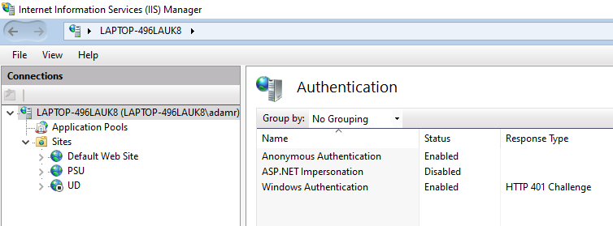

# Dashboards

Dashboards are individual websites created with Universal Dashboard. You can define settings for a dashboard and start and stop the dashboard from within the Universal administrative interface. 

## Adding a Dashboard

Dashboards can be added to Universal using the Add Dashboard button from the Dashboard / Dashboards page. 

**Name**

Name is displayed throughout the UI and returned from the Universal cmdlets. 

**Base URL**

The base URL is the URL that you will access to view this dashboard. This URL needs to be unique within this instance. You can specify the `/` root URL if you wish. You will have to visit `/admin` to login to the administrative page if you set the dashboard to the root URL. 

**File Name**

The full file name to the dashboard file. This file needs to return a dashboard using New-UDDashboard. 

**Framework**

The framework that the dashboard was designed for. By default, Universal Dashboard v2.9 and v3.0 are supported. 

**PowerShell Version**

The version of PowerShell to host this dashboard within. 

## Starting and Stopping Dashboards

Similar to jobs, dashboards run in separate PowerShell processes. You can start and stop a dashboard process by clicking the Start or Stop button from the Dashboards page. 

## Viewing Diagnostic Information 

You can view diagnostic information for a dashboard by clicking the Info button on the Dashboards page. This will show your start information for the dashboard as well as any error that were encountered when starting the dashboard. 

## Viewing the Dashboard

You can view the dashboard by clicking the View button. This will take you to the Base URL for the dashboard. 

