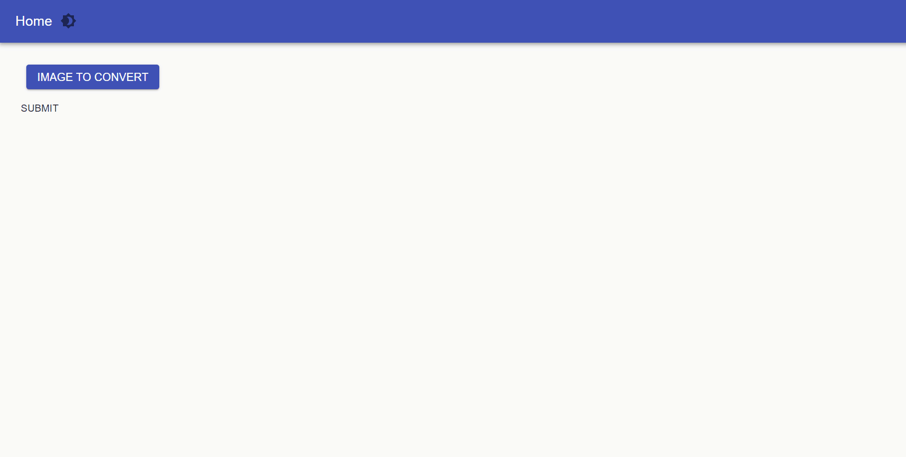

# Image Processing

## Convert JPEG to PNG

This example uses [PowerShell Universal Dashboard](../dashboard/about.md). 

This examples accepts a JPEG file and converts to to a PNG using Universal Dashboard. To implement this example, we need to use published folders and a dashboard that uses UDForm and the UDUpload component. After converting the image, it displays it. 

```text
Start-PSUServer -Port 8080 -Configuration {
    New-PSUPublishedFolder -Path 'C:\images' -RequestPath '/images'

    New-PSUDashboard -Name 'Convert' -BaseUrl '/' -Framework 'UniversalDashboard:Latest' -Content {
        New-UDDashboard -Title 'Convert' -Content {
            New-UDForm -Content {
                New-UDUpload -Id 'image' -Text 'Image to Convert'
            } -OnSubmit {
                $bytes = [System.Convert]::FromBase64String($EventData.image.Data)

                $Bitmap = [System.Drawing.Image]::FromStream([System.IO.MemoryStream]::new($bytes))
                $Bitmap.Save("C:\images\$($EventData.Image.Name)".Replace("jpeg", "png"), 'PNG')

                New-UDImage -Url "/images/$($EventData.Image.Name.Replace('jpeg', 'png'))"
            }
        }
    }

}
```



## Convert JPEG to PNG API

This example uses [PowerShell Universal API](../api/about.md).

This example is similar to the dashboard example but exposes the functionality as an API rather than a webpage. The API accepts a POST request that contains the image as a the body. We use the `$Data` variable which contains the byte array for the image file and then convert it use the same method. We then take advantage of the `New-PSUApiResponse` cmdlet to return a custom response. 

```text
Start-PSUServer -Port 8080 -Configuration {
    New-PSUEndpoint -Url "/image" -Method POST -Endpoint {
        $Bitmap = [System.Drawing.Image]::FromStream([System.IO.MemoryStream]::new($Data))
        $Bitmap.Save("$Env:Temp\image.png", 'PNG')

        New-PSUApiResponse -Data ([IO.File]::ReadAllBytes("$Env:Temp\image.png")) -ContentType 'application\png'

        Remove-Item "$Env:Temp\image.png"
    }
}
```

We can invoke the API with `Invoke-WebRequest`. The below example posts the IMG\_2260.jpeg file and converts it to an image.png file.

```text
invoke-webrequest -InFile .\IMG_2260.jpeg -Uri http://localhost:8080/image -Method POST -OutFile .\image.png
```

## Rate Limited Conversion API

This example uses [PowerShell Universal API](../api/about.md). This example requires a [license](../get-started/licensing.md).

This example provides the same functionality as the previous example but rate limits the number of requests to 5 per 10 minutes. We can use `New-PSURateLimit` to set the request limit. 

```text
Start-PSUServer -Port 8080 -Configuration {
    Set-PSULicense -Key "key"

    New-PSURateLimit -Endpoint "POST:/image" -Period ([TimeSpan]::FromMinutes(10)) -Limit 5

    New-PSUEndpoint -Url "/image" -Method POST -Endpoint {
        $Bitmap = [System.Drawing.Image]::FromStream([System.IO.MemoryStream]::new($Data))
        $Bitmap.Save("$Env:Temp\image.png", 'PNG')

        New-PSUApiResponse -Data ([IO.File]::ReadAllBytes("$Env:Temp\image.png")) -ContentType 'application\png'

        Remove-Item "$Env:Temp\image.png"
    }
} 
```

Invoking this request most than the specified number of times will result in an error. 

```text
PS C:\Users\adamr> invoke-webrequest -InFile .\IMG_2260.jpeg -Uri http://localhost:8080/image -Method POST -OutFile .\image.png
Invoke-WebRequest: API calls quota exceeded! maximum admitted 5 per .
```

